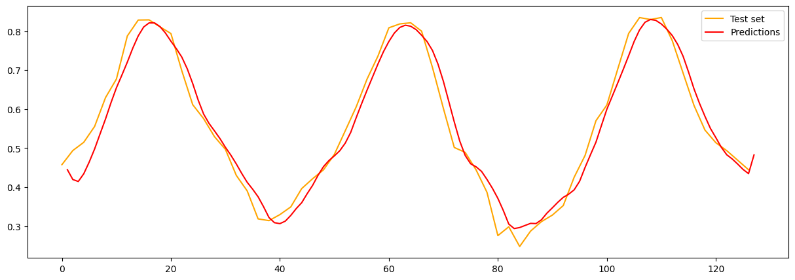

# NDVI Timeseries Forecasting

Forecasting NDVI values using ConvLSTM.

### Methodology

Forecasting a timeseries of NDVI values using previous NDVI, precipitation, and temperature as predictors. Using ConvLSTM to extract both the temporal and spatial patterns of the data.

Steps:
1. Download all input data.
2. Resample each dataset to desired temporal & spatial resolutions.
    - Currently: 8 day & 9x9km
4. Combine datasets based on coordinates & time (using "nearest" method).
5. Normalize datasets.
6. Create & compile model.
7. Run model for train & validation sets.
8. Repeat steps 6 & 7 with different architectures and hyperparameters to fine-tune the model (based on validation score, trendline analysis, and examination of spatial accuracy).
9. Run predictions for test set.

### Current results

Timeseries & spatial elements picked up quite well. ConvLSTM results are slightly blurred, which is a well known effect of the algorithm. Need to test a rolling prediction for a longer timeseries as well as predicting different times of year.

### Currently tested datasets
- 2m temperature
    - Resolution
        - Temporal: Hourly
        - Spatial: 9x9km
    - Source: [ERA5-Land](https://cds.climate.copernicus.eu/cdsapp#!/dataset/reanalysis-era5-land?tab=overview)
- Total precipitation
    - Resolution
        - Temporal: Hourly
        - Spatial: 9x9km
    - Source: [ERA5-Land](https://cds.climate.copernicus.eu/cdsapp#!/dataset/reanalysis-era5-land?tab=overview)
- NDVI
    - Resolution
        - Temporal: 16-day
        - Spatial: 1x1km
    - Source: [MOD13A2](https://lpdaac.usgs.gov/products/mod13a2v006/php)
- Cropland Dominance
    - Resolution
        - Temporal: 1 timestep (2009)
        - Spatial: 1x1km
    - Source: [GFSAD1KCD](https://lpdaac.usgs.gov/products/gfsad1kcdv001/)

### Tested locations
- Iowa, USA
    - Currently being used
- Borneo, Indonesia
- Alberta, Canada

### Future Improvements
- [x] Rolling mean for precipitation
    - Separate the signal from the noise
- [ ] Expand number of samples
- [ ] Fix border issue
- [ ] Additional datasets
    - [ ] Soil map
    - [ ] Landcover (?)
    - [ ] More detailed crop cover
    - [ ] Palm oil expansion (Borneo)
- [ ] Additional hyperparameter tuning
- [ ] In depth examination on layers & weights
- [ ] Generate NDVI in-house, using satellite imagery for Red & NIR bands at a higher temporal resolution.

### References

- [Convolutional LSTM Network: A Machine Learning Approach for Precipitation Nowcasting](https://arxiv.org/abs/1506.04214)
- [A machine-learning based ConvLSTM architecture for NDVI forecasting](https://onlinelibrary.wiley.com/doi/abs/10.1111/itor.12887)
- [A Quantum Machine Learning Approach to Spatiotemporal Emission Modelling](https://www.researchgate.net/publication/371122374_A_Quantum_Machine_Learning_Approach_to_Spatiotemporal_Emission_Modelling)
- [Rainfall–runoff modelling using Long Short-Term Memory (LSTM) networks](https://hess.copernicus.org/articles/22/6005/2018/)